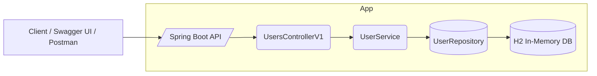
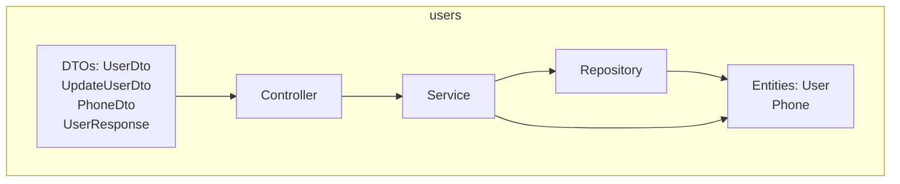
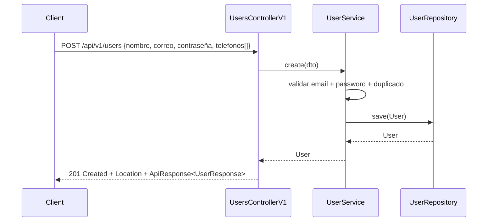
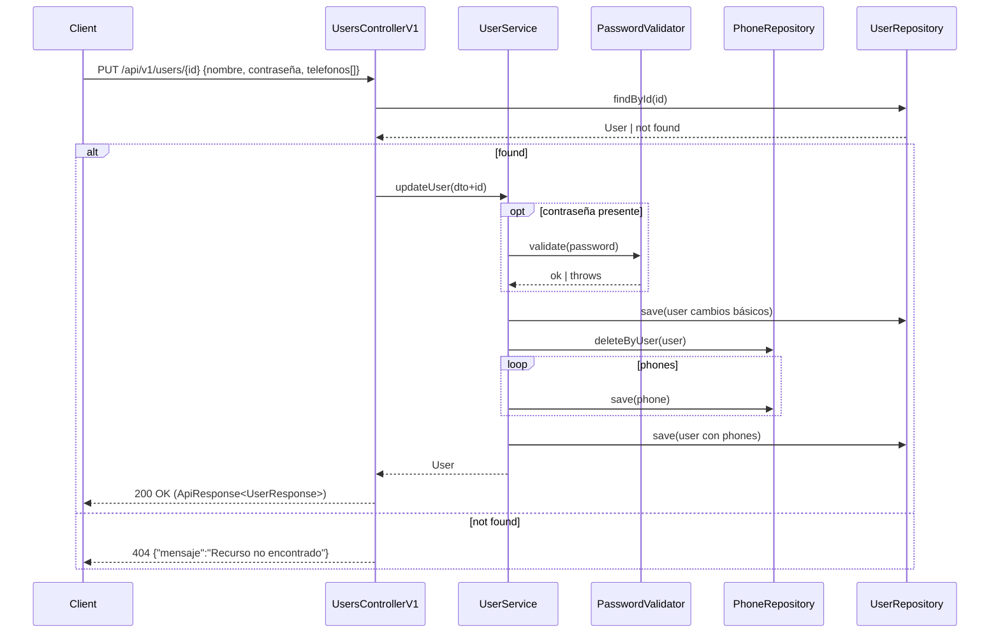
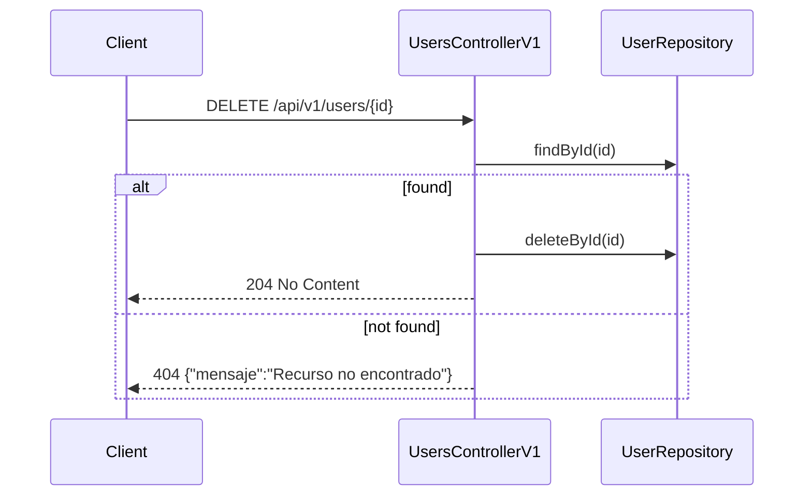
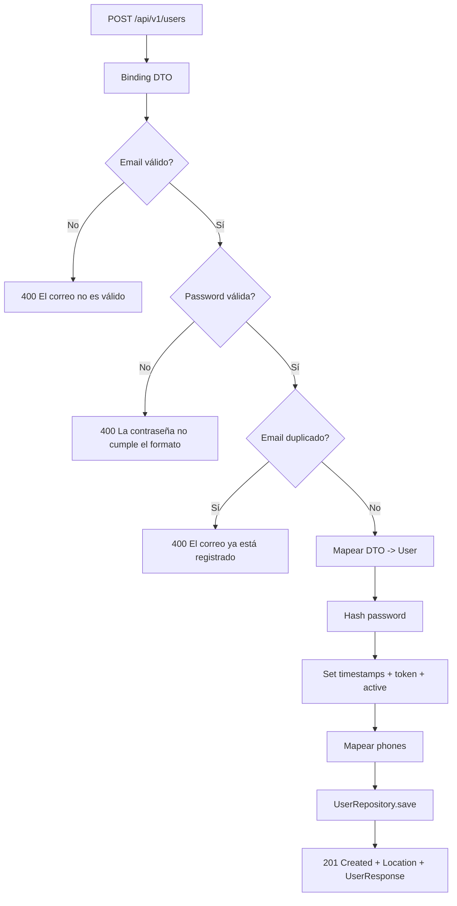
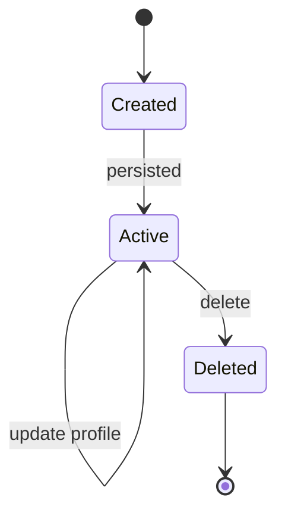
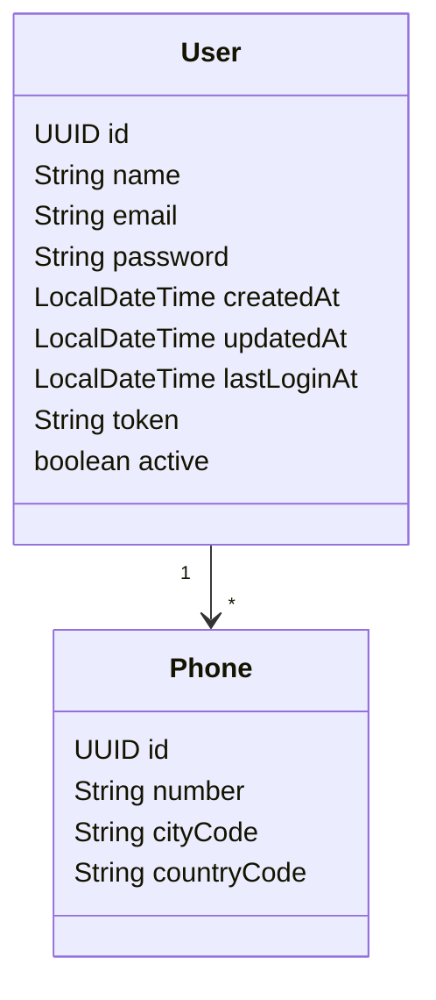
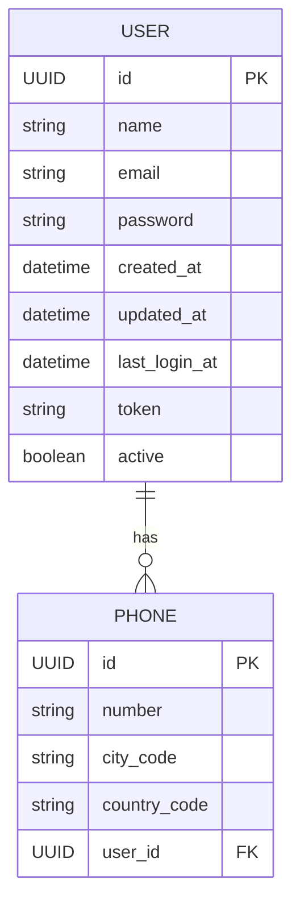

# Diagrams

## Architecture

## Components

## Sequence: Create User

## Sequence: Update User (PUT)

## Sequence: Delete User

## Validación y Persistencia (Create)

## State: Ciclo de vida de User

## Data Model

## ER: Modelo Relacional

