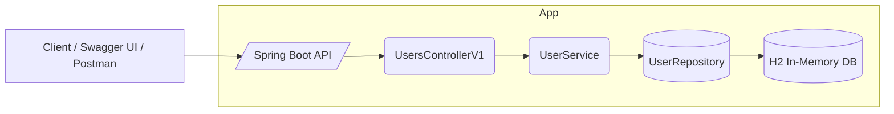
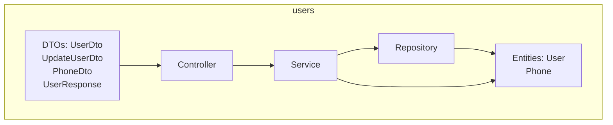
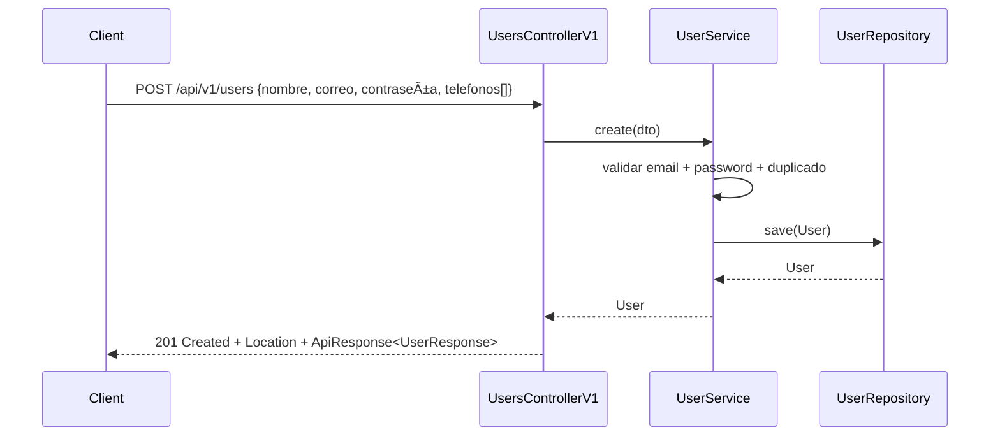
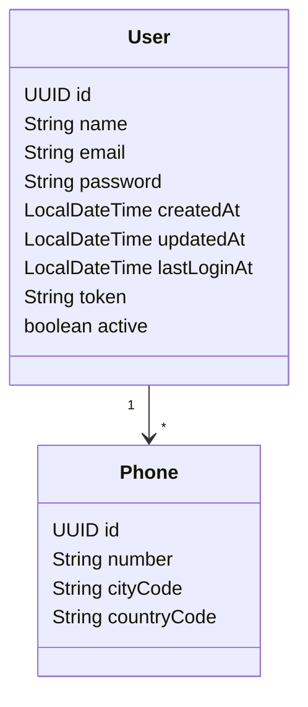

# Diagrams

## Architecture

```mermaid
flowchart LR
Client[Client / Swagger UI / Postman] --> API[/Spring Boot API/]
subgraph App
API --> C(UsersControllerV1)
C --> S(UserService)
S --> R[(UserRepository)]
R --> H2[(H2 In-Memory DB)]
end
```

## Components

```mermaid
flowchart TB
  subgraph users
    CTRL[Controller];
    SVC[Service];
    DTO["DTOs: UserDto\nUpdateUserDto\nPhoneDto\nUserResponse"];
    REP[Repository];
    ENT["Entities: User\nPhone"];
  end
  DTO --> CTRL
  CTRL --> SVC
  SVC --> REP
  REP --> ENT
  SVC --> ENT
```

## Sequence: Create User

```mermaid
sequenceDiagram
participant U as Client
participant C as UsersControllerV1
participant S as UserService
participant R as UserRepository
U->>C: POST /api/v1/users {nombre, correo, contraseña, telefonos[]}
C->>S: create(dto)
S->>S: validar email + password + duplicado
S->>R: save(User)
R-->>S: User
S-->>C: User
C-->>U: 201 Created + Location + ApiResponse<UserResponse>
```

## Data Model

```mermaid
classDiagram
class User {
UUID id
String name
String email
String password
LocalDateTime createdAt
LocalDateTime updatedAt
LocalDateTime lastLoginAt
String token
boolean active
}

class Phone {
UUID id
String number
String cityCode
String countryCode
}

User "1" --> "*" Phone
```